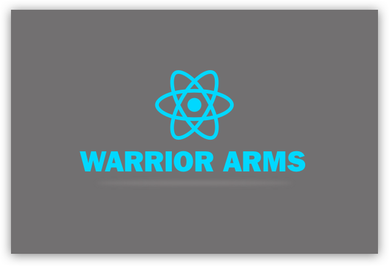

[](http://standardjs.com/)

# Warrior Arms

My boilerplate to ReactJS

## Usage

Install packages:
```sh
./warrior.sh
```

Run webpack-dev-server:
```sh
yarn start
```

Run StoryBook
```sh
yarn storybook
```

Run Tests with Jest
```sh
yarn test
```

Run Build
```sh
yarn build
```

Be Happy :smiley:

## Special Thanks

@fdaciuk for base project in [fdaciuk/workflow-reactjs](https://github.com/fdaciuk/workflow-reactjs).

## ToDo

- [x] CSS loaders
- [x] File loader
- [ ] Image loaders
- [x] `hot-loader`
- [ ] Shell Script to install environment
